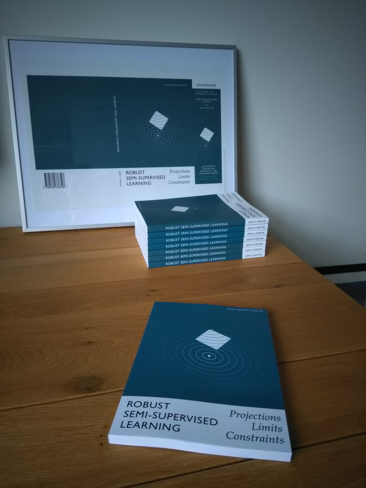

I defended my PhD thesis! The thesis "Robust Semi-supervised Learning: Projections, Limits & Constraints" is about exploring the limits of the guarantees one can give for whether a semi-supervised learner will outperform its supervised counterpart. In other words: the limits of the usefulness of additional unlabeled data in a supervised learning setting. 

While it seems to make sense you would want such guarantees before using semi-supervised methods to incorporate unlabeled data into the learning process, we show that without additional assumptions, for many supervised learners, semi-supervised alternatives with strict non-degradation guarantees can not be constructed. Perhaps surprisingly, however, for some supervised learners/loss functions, semi-supervised methods can be constructed that give strict non-degradation guarantees. For details of how these concepts (guarantees, performance) were defined, please see the thesis itself. After thinking about this topic for such a long time, I'm quite proud of how the thesis turned out. You can find it [here](/thesis.pdf).

(As an aside: the thesis is typeset using R's knitr package and Latex. You can find the source code to generate figures and text [here](https://github.com/jkrijthe/RobustSSL))

As part of the thesis defense, at most Dutch universities, you are expected to include a set of propositions, some pertaining to the core claims made in the thesis, some about your field of research and some about science/society in general. These were my propositions included in the thesis:

1. Semi-supervised learning without additional assumptions, beyond those inherent in the supervised classifier, is possible.
2. One can guarantee performance improvement of some semi-supervised learners over their supervised counterparts. 
3. Truly safe semi-supervised learning is impossible for a large class of commonly used classifiers.
4. Considering a classification method's performance in terms of the actual loss it minimizes at train time gives useful insights. 
5. There is a limit to the usefulness of asymptotic results.
6. Rather than hoping for practice to better correspond to current statistical methods, we need new methods that better match the adaptive way statistics is used in practice.
7. The focus in statistical practice on hypothesis testing is feeding society's appetite to clear cut answers in a reality where none are available.
8. Data is uninteresting without a model, while a model can be interesting without data.
9. Publishers have become a dispensible part of scientific communication.
10. Our unwillingness or inability to define our actual goals, combined with a need for certainty, lead to surrogate measures (e.g. GDP, H-index, wealth, `likes' on social media) that are actively harmful.

I again want to thank my opposition committee: Ludmila Kuncheva, Peter Grunwald, Jelle Goeman, Erik van den Akker and Tom Heskes for the insightful questions that made for a super enjoyable discussion.
